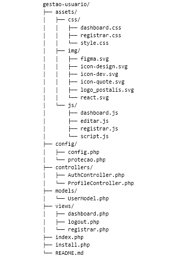

# Gestão de Usuário

  <a href="#-tecnologias">Tecnologias</a>&nbsp;&nbsp;&nbsp;|&nbsp;&nbsp;&nbsp;
  <a href="#-projeto">Projeto</a>&nbsp;&nbsp;&nbsp;|&nbsp;&nbsp;&nbsp;
  <a href="#Estrutura do Projeto">Estrutura do Projeto</a>&nbsp;&nbsp;&nbsp;|&nbsp;&nbsp;&nbsp;
  <a href="#-Configuração">Configuração</a>&nbsp;&nbsp;&nbsp;|&nbsp;&nbsp;&nbsp;
  <a href="#memo-licença">Licença</a>

## 🚀 Tecnologias

Esse projeto foi desenvolvido com as seguintes tecnologias:

- HTML e CSS
- JavaScript
- Git e Github
- MySQL

## 💻 Projeto

* Este é um projeto de uma aplicação PHP para registro, login e gerenciamento de perfil de usuários. 
A aplicação utiliza MySQL para armazenamento de dados e inclui integração com CSS para layout e JavaScript para interatividade.

## Estrutura do Projeto

## Explicação das Pastas e Arquivos

1. assets/: Contém arquivos estáticos como CSS, imagens e JavaScript.

2. config/: Contém arquivos de configuração, como o banco de dados e outras configurações de segurança.

3. controllers/: Contém os controladores que lidam com a lógica da aplicação e a interação entre o modelo e a visão.

4. models/: Contém as classes de modelo que representam os dados e a lógica de acesso ao banco de dados.

5. views/: Contém os arquivos de visualização, que são responsáveis pela apresentação dos dados ao usuário.

6. index.php: O ponto de entrada para a aplicação, que pode redirecionar para os controladores apropriados.

7. README.md: Documentação do projeto.

## 🛠️ Configuração

1. **Clone o Repositório**: 
   - Clone este repositório: `git clone https://github.com/janainarque/gestao-usuario.git `

2. **Configure as Credenciais do Banco de Dados**: 
   - Configure as credenciais do banco de dados no arquivo `config/config.php`.

3. **Crie o Banco de Dados e as Tabelas**:
   - Para configurar o banco de dados e as tabelas, acesse o seguinte URL no seu navegador: http://localhost:8080/gestao-usuario/install.php
   - Este script criará o banco de dados e as tabelas necessárias para o funcionamento da aplicação.

4. **Remova o Arquivo install.php**:
   - Após a criação do banco de dados e das tabelas, por questões de segurança, remova o arquivo install.php. Isso evitará que o script seja executado acidentalmente no futuro. Você pode deletá-lo manualmente ou movê-lo para fora do diretório de acesso público.

5. **Acesse a Aplicação**:
   - Para acessar a aplicação, navegue até a URL principal do projeto: http://localhost:8080/gestao-usuario/
   - Você deverá ver a tela de navegação da aplicação.

## Problemas e Soluções
   - Erro ao Conectar ao Banco de Dados: Verifique as credenciais no arquivo config/config.php e se o servidor MySQL está funcionando corretamente.
   - Página Não Encontrada: Certifique-se de que a URL está correta e que o arquivo .htaccess está presente e configurado corretamente para redirecionar as requisições para o index.php.

## :memo: Licença

Esse projeto está sob a licença MIT - veja o arquivo [LICENSE](LICENSE) para mais detalhes.
